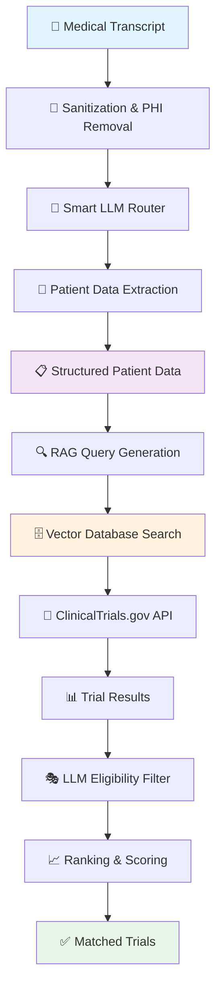
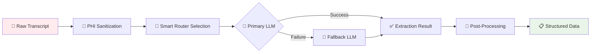
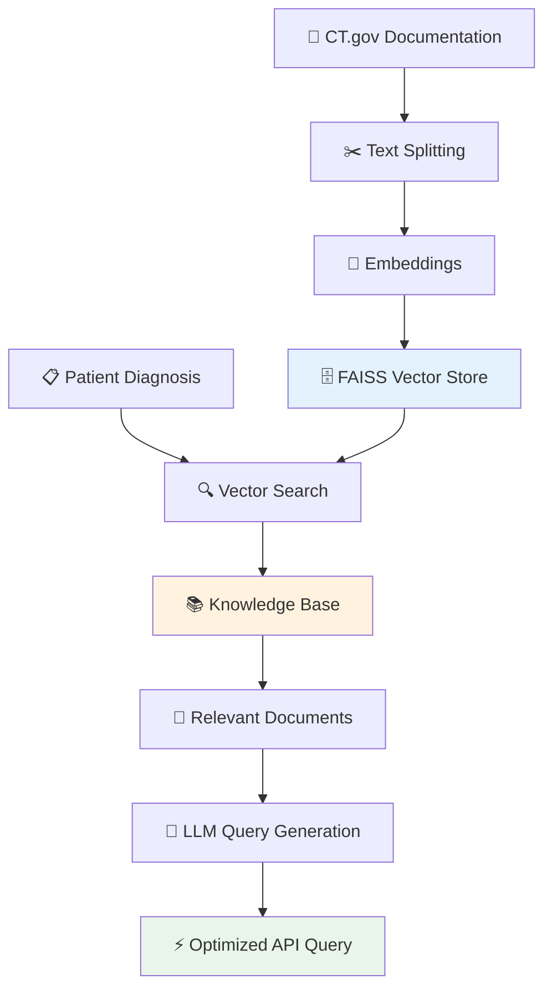
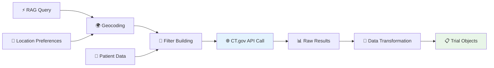
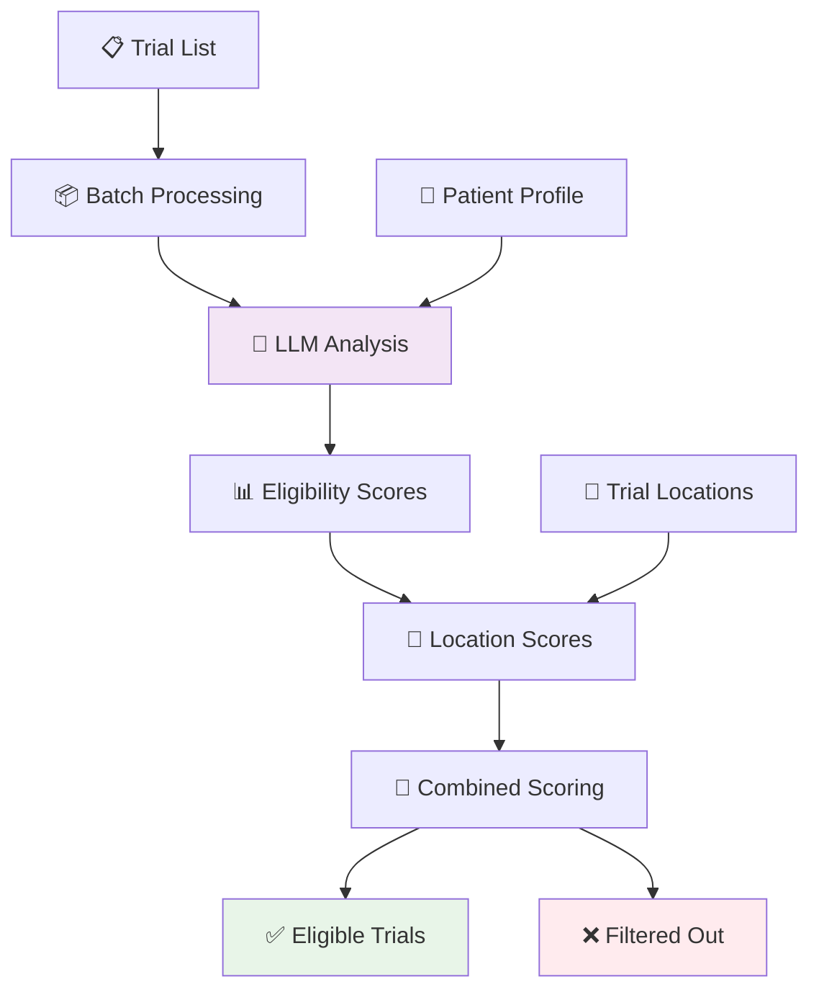
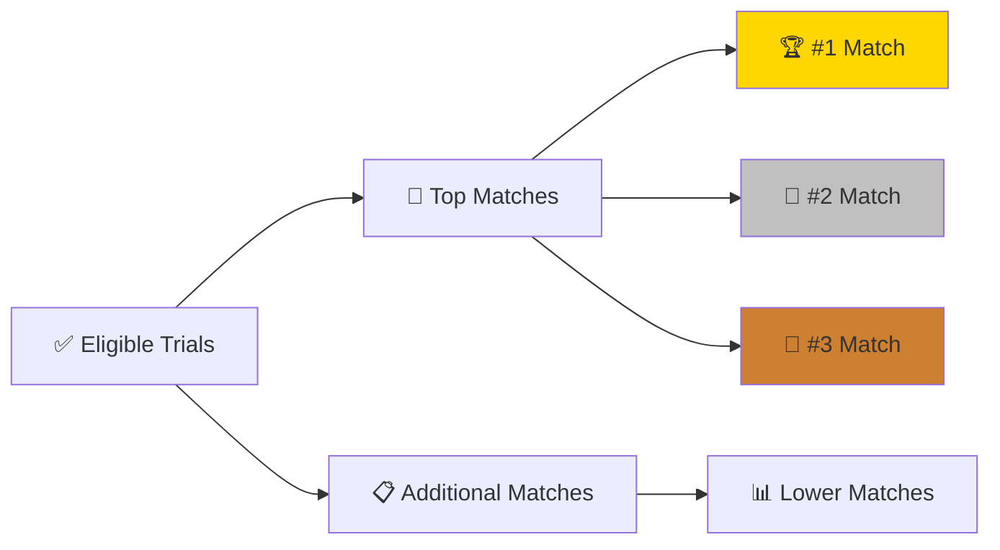

# 🧠 DeepScribe LLM Flow Documentation

## 📊 System Overview

DeepScribe uses a sophisticated multi-stage LLM pipeline to match patients with clinical trials. The system combines **patient data extraction**, **RAG-powered query generation**, **intelligent trial search**, and **LLM-based eligibility analysis** to provide accurate trial matching.

---

## 🔄 Complete Flow Architecture



---

## 🎯 Stage 1: Patient Data Extraction

### **Service**: `patient_extractor.py`
**🎯 Purpose**: Transform unstructured medical transcripts into structured patient data



### **Key Features**:
- **🛡️ PHI Protection**: Removes SSN, phone numbers, emails, ZIP codes
- **🎯 Smart Routing**: Selects optimal LLM based on transcript complexity
- **🔄 Automatic Fallback**: OpenAI ↔ Claude failover system
- **🧠 Intelligent Enhancement**: Age inference, location normalization

### **LLM Router Logic**:
```python
# Complexity scoring factors:
- Medical terminology density
- Condition complexity 
- Medication count
- Specialist mentions
- Transcript length

# Selection criteria:
- Short + Simple → OpenAI (fast, cost-effective)
- Long + Complex → Claude (better reasoning)
```

---

## 🔍 Stage 2: RAG-Powered Query Generation

### **Service**: `langchain_rag_service.py`
**🎯 Purpose**: Generate optimized ClinicalTrials.gov search queries using domain knowledge



### **Vector Database Implementation**:
- **📊 Embeddings**: OpenAI `text-embedding-3-small`
- **🗄️ Storage**: FAISS in-memory vector store
- **📚 Knowledge Base**: ClinicalTrials.gov API documentation
- **✂️ Chunking**: Recursive character text splitter

### **Query Enhancement Example**:
```
Input: "acute lymphoblastic leukemia"
Output: "EXPANSION[Concept]acute lymphoblastic leukemia OR EXPANSION[Concept]ALL OR EXPANSION[Concept]acute lymphocytic leukemia"
```

---

## 🔍 Stage 3: Clinical Trials Search

### **Service**: `trials_client.py`
**🎯 Purpose**: Execute intelligent trial searches with geographic and demographic filtering



### **Search Parameters**:
- **📊 Conditions**: RAG-enhanced query with medical concept expansion
- **👤 Demographics**: Age ranges with buffer zones, gender matching
- **📍 Geography**: Geocoded locations with distance calculations
- **📈 Status**: Active trials (RECRUITING, NOT_YET_RECRUITING, ACTIVE_NOT_RECRUITING)

---

## 🎭 Stage 4: LLM Eligibility Analysis

### **Service**: `llm_eligibility_filter.py`
**🎯 Purpose**: Use AI to analyze complex eligibility criteria and rank trial fit



### **Scoring Algorithm**:
```python
combined_score = (eligibility_score × 0.7) + (location_score × 0.3)

# Eligibility factors analyzed:
- Age requirements vs patient age
- Medical condition match
- Required lab values
- Exclusion criteria
- Treatment history
- Comorbidities

# Location factors:
- Geographic distance
- Travel accessibility
- Multi-site availability
```

### **LLM Analysis Process**:
1. **📋 Batch Processing**: Groups trials for efficient analysis (5 trials per batch)
2. **🎯 Structured Prompts**: JSON-formatted eligibility questions
3. **🧠 Reasoning Generation**: Human-readable explanations for decisions
4. **🚫 Smart Filtering**: Automatically excludes poor matches

---

## 📈 Stage 5: Final Ranking & Results

### **Output Structure**:


### **Match Factors Displayed**:
- **🎯 Condition Match**: How well the condition aligns
- **✅ Eligibility Fit**: Meeting inclusion/exclusion criteria  
- **📍 Enrollment Status**: Current recruitment phase
- **🌍 Geographic Proximity**: Distance and accessibility

---

## 🛠️ Technical Implementation Details

### **LLM Provider Management**:
```python
# Smart routing based on:
class SmartLLMRouter:
    def select_provider(transcript):
        complexity = calculate_complexity(transcript)
        length = len(transcript.split())
        
        if length > 1000 or complexity > 0.4:
            return Claude  # Better for complex reasoning
        else:
            return OpenAI  # Faster for simple extractions
```

### **Vector Database Configuration**:
```python
# FAISS setup for clinical trials documentation
vector_store = FAISS.from_documents(
    documents=clinical_docs,
    embedding=OpenAIEmbeddings(model="text-embedding-3-small")
)

# Retrieval chain for query generation
retrieval_chain = create_retrieval_chain(
    retriever=vector_store.as_retriever(search_kwargs={"k": 5}),
    combine_docs_chain=stuff_documents_chain
)
```

### **Error Handling & Fallbacks**:
- **🔄 Provider Fallback**: OpenAI ↔ Claude automatic switching
- **📊 Partial Extraction**: Graceful degradation when some data missing
- **🛡️ PHI Protection**: Multiple sanitization layers
- **⚡ Timeout Handling**: Async operations with proper error boundaries

---

## 📊 Performance Metrics

### **From Sample Log Analysis**:
- **⚡ Extraction Time**: ~25 seconds total pipeline
- **🔍 API Efficiency**: Single ClinicalTrials.gov call with optimized query
- **🎯 Filtering Accuracy**: 7/10 trials filtered out for specific eligibility issues
- **📍 Geographic Matching**: Automatic geocoding (Portland, Oregon → coordinates)

### **LLM Usage Optimization**:
- **📦 Batch Processing**: 5 trials per LLM call for eligibility analysis
- **🎯 Smart Routing**: Complexity-based provider selection
- **🔄 Fallback Strategy**: Minimize failed extractions
- **📊 Token Efficiency**: Structured prompts with JSON responses

---

## 🏁 Real-World Example Flow

Based on the provided logs for an 18-year-old female with B-ALL:

```
1. 📝 Transcript Processing → Extracted: Age 18, B-ALL, Female, Portland OR
2. 🔍 RAG Query Generation → "EXPANSION[Concept]acute lymphoblastic leukemia OR..."  
3. 🌐 API Search → Found 10 initial trials
4. 🎭 LLM Filtering → Filtered out 7 trials:
   - NCT06855810: Age requirement (<18 years)
   - NCT06289673: Age requirement (<18.99 years) 
   - NCT05745181: T-ALL specific (patient has B-ALL)
   - NCT06934382: T-ALL specific (patient has B-ALL)
   - etc.
5. ✅ Final Results → 3 eligible trials with detailed reasoning
```

This demonstrates the system's ability to make nuanced medical decisions, understanding that:
- **Age boundaries** are strictly enforced
- **Disease subtypes** (B-ALL vs T-ALL) are critical distinctions
- **Geographic preferences** are factored into scoring

---

## 🚀 System Advantages

- **🎯 High Precision**: LLM-based eligibility analysis catches nuanced requirements
- **⚡ Efficient Processing**: RAG reduces API calls while improving query quality  
- **🛡️ Privacy First**: Multiple PHI protection layers
- **🔄 Reliable**: Multi-provider fallback ensures high availability
- **📊 Transparent**: Detailed reasoning for all matching decisions
- **🧠 Adaptive**: Smart routing optimizes for speed vs complexity trade-offs

The system successfully combines the power of large language models with traditional search and filtering techniques to provide accurate, explainable clinical trial matching.