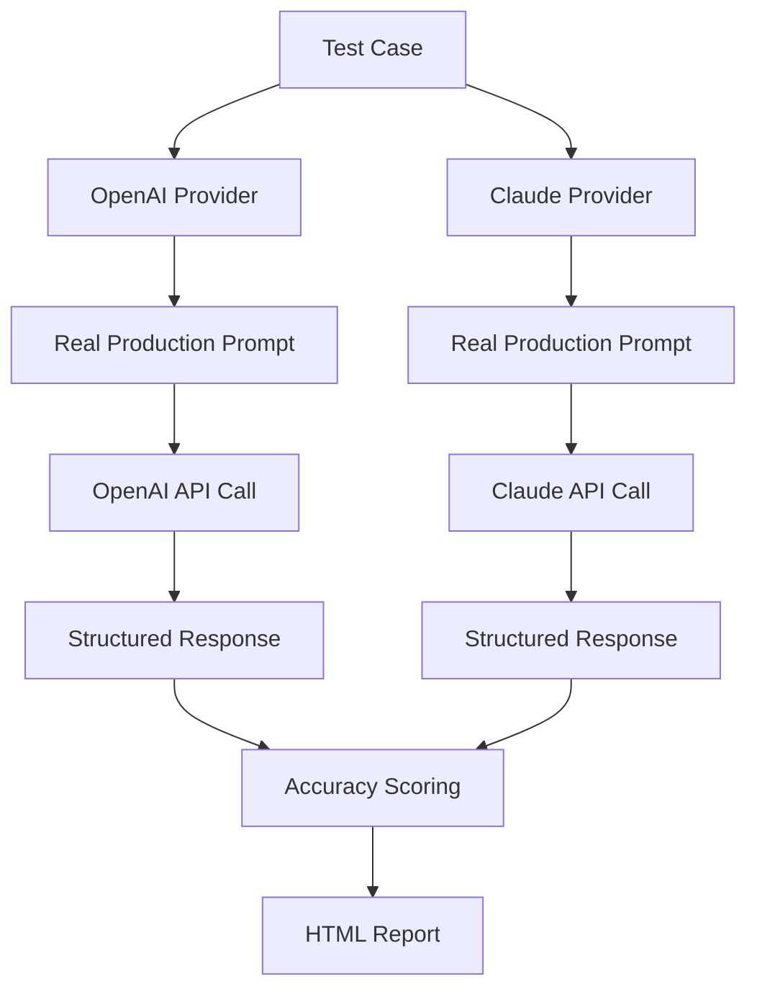

# 🧪 LLM Prompt Evaluation Framework

## Overview

This evaluation framework tests the **actual production prompts** used in our Clinical Trial Matching system. It measures prompt effectiveness, consistency, and accuracy across different medical scenarios.

## 🎯 What We're Testing

### 1. **Real Production Prompts**
- **OpenAI GPT-4 prompts** - Exact prompts sent to OpenAI API
- **Claude prompts** - Exact prompts sent to Anthropic API
- **No mocking** - Real API calls with real responses

### 2. **Three Core Capabilities**
```
📊 Extraction Accuracy    How well prompts extract structured medical data
🔄 Consistency           Same results for similar inputs  
🏥 Edge Case Handling     Performance on ambiguous/incomplete data
```

### 3. **Test Categories**
- **extraction_accuracy**: Clear medical scenarios with expected outputs
- **consistency**: Same information presented differently 
- **edge_cases**: Ambiguous, minimal, or unusual medical presentations

## 🔬 How It Works

### Evaluation Flow


### Code Path
```python
# 1. Initialize real providers (same as production)
self.openai_provider = OpenAIProvider(self.config)
self.claude_provider = ClaudeProvider(self.config)

# 2. Call real extraction method
extraction_result = await provider.extract_patient_data(transcript)

# 3. Uses real production prompt
prompt = provider._build_extraction_prompt(transcript)  # Actual prompt!

# 4. Real API call
response = provider.client.chat.completions.create(...)  # Real OpenAI/Claude call
```

## 📈 Scoring System

### Accuracy Score (0.0 - 1.0)
- **Field Weights**: Primary diagnosis (30%), Age (15%), Cancer stage (15%), etc.
- **Partial Credit**: Medication lists, comorbidities get overlap scoring
- **Location Matching**: City/state normalization and comparison

### Confidence Calibration
- **Expected Ranges**: Each test case defines expected confidence levels
- **Calibration Check**: Flags when confidence doesn't match scenario difficulty
- **Examples**: Ambiguous cases should have 0.3-0.6 confidence

### Performance Categories
| Score | Classification | Color |
|-------|----------------|-------|
| 0.9+ | Excellent | 🟢 Green |
| 0.75+ | Good | 🔵 Blue |
| 0.5+ | Fair | 🟡 Yellow |
| <0.5 | Poor | 🔴 Red |

## 🚀 Running Evaluations

### Quick Start
```bash
# Run full evaluation with HTML report
python evaluate_llms.py
```

### Expected Output
```
🧪 Evaluating Current Production Prompts...
============================================================

🔬 Testing: Perfect_Extraction_Oncology
📝 Category: extraction_accuracy | Difficulty: easy
   OpenAI: ✅ Score: 0.889 | Confidence: 0.900
   Claude: ✅ Score: 0.889 | Confidence: 0.900

...

📊 PROMPT EVALUATION ANALYSIS
============================================================
📈 Overall Performance:
   • Success Rate: 100.0%
   • Average Accuracy: 0.706
   • Avg Execution Time: 3538ms

💾 Detailed results saved to: prompt_evaluation_1642681234.json
🌐 Visual report saved to: prompt_evaluation_1642681234.html
📋 Open prompt_evaluation_1642681234.html in your browser
```

### Output Files
- **JSON Report**: `prompt_evaluation_[timestamp].json` - Detailed machine-readable results
- **HTML Report**: `prompt_evaluation_[timestamp].html` - Interactive visual dashboard

## 📊 Understanding Results

### HTML Report Sections

#### 1. **Overall Metrics Dashboard**
```
┌─────────────┬─────────────┬─────────────┬─────────────┐
│ Success Rate│Avg Accuracy │Response Time│ Total Tests │
│   100.0%    │   0.706     │   3538ms    │     16      │
└─────────────┴─────────────┴─────────────┴─────────────┘
```

#### 2. **Provider Comparison Chart**
- Bar chart comparing OpenAI vs Claude performance
- Success rate, accuracy, and confidence metrics
- Identifies which provider performs better on specific tasks

#### 3. **Category Performance Breakdown**
- Doughnut chart showing performance by test category
- Highlights areas needing improvement (extraction vs edge cases)

#### 4. **Detailed Test Results**
- Individual test case results with transcripts
- Score badges (color-coded by performance)
- Error messages for failed expectations
- Confidence calibration issues

### Reading the Results

#### ✅ **Good Signs**
- **High Extraction Scores (>0.8)**: Prompts work well on clear medical data
- **Consistent Confidence**: Scores match expected difficulty levels
- **Low Response Times (<3s)**: Efficient prompt design

#### ⚠️ **Warning Signs**
- **Low Edge Case Scores (<0.5)**: Prompts struggle with ambiguous data
- **Poor Consistency (<0.8)**: Different results for similar inputs
- **Miscalibrated Confidence**: High confidence on ambiguous cases

## 🔧 Test Cases Explained

### Current Test Suite (8 Cases)

#### **Extraction Accuracy Tests**
1. **Perfect_Extraction_Oncology** - Clear breast cancer case with all details
2. **Complex_Multi_Condition** - NSCLC with multiple comorbidities
3. **Medication_Extraction_Challenge** - Multiple medications with dosing

#### **Edge Case Tests**
4. **Minimal_Information_Edge_Case** - Just age, fatigue, location
5. **Ambiguous_Diagnosis_Test** - Suspicious findings, no confirmed diagnosis
6. **Creative_Interpretation_Test** - Neurological symptoms, no clear diagnosis

#### **Consistency Tests**
7. **Consistency_Test_A** - T1DM patient, formal medical language
8. **Consistency_Test_B** - Same patient, informal abbreviations (T1DM, CO)

### Adding New Test Cases

```python
PromptTestCase(
    name="Your_Test_Name",
    transcript="Medical transcript text...",
    expected_extraction={
        "age": 45,
        "primary_diagnosis": "condition name",
        # ... other expected fields
    },
    expected_confidence_range=(0.7, 0.9),  # Expected confidence range
    difficulty_level="medium",  # easy, medium, hard
    test_category="extraction_accuracy"  # or edge_cases, consistency
)
```

## 🛠️ Customization

### Modifying Scoring Weights
```python
# In _calculate_extraction_accuracy()
field_weights = {
    "primary_diagnosis": 0.40,  # Increase importance
    "age": 0.10,               # Decrease importance
    "medications": 0.15,       # Adjust as needed
}
```

### Adding New Metrics
1. **Response Quality**: Measure JSON validity, completeness
2. **Semantic Accuracy**: Compare extracted vs expected meanings
3. **Prompt Token Usage**: Track efficiency metrics

## 📋 Interpreting Recommendations

### Common Issues & Fixes

#### **Low Consistency Score**
- **Problem**: Different results for similar inputs
- **Solution**: Add more specific examples to prompts
- **Example**: "T1DM should be normalized to 'Type 1 diabetes mellitus'"

#### **Poor Edge Case Performance** 
- **Problem**: High confidence on ambiguous cases
- **Solution**: Add uncertainty handling instructions
- **Example**: "When diagnosis is unclear, set primary_diagnosis to null"

#### **Confidence Miscalibration**
- **Problem**: Confidence doesn't match scenario difficulty
- **Solution**: Refine confidence scoring instructions
- **Example**: "For ambiguous symptoms, use confidence 0.3-0.6"

## 🔄 Continuous Improvement Workflow

1. **Run Baseline**: `python evaluate_llms.py`
2. **Identify Issues**: Review HTML report recommendations
3. **Modify Prompts**: Edit `api/services/llm_provider.py`
4. **Re-evaluate**: Run tests again
5. **Compare Results**: Check if scores improved
6. **Iterate**: Repeat until satisfactory performance

## 📊 Performance Benchmarks

### Target Metrics
- **Overall Accuracy**: >80%
- **Extraction Accuracy**: >85%
- **Edge Case Handling**: >60%
- **Consistency Score**: >85%
- **Response Time**: <3000ms average

### Current Performance (Latest Run)
- ✅ **Success Rate**: 100.0%
- ⚠️ **Average Accuracy**: 70.6% (needs improvement)
- ⚠️ **Response Time**: 3538ms (acceptable but slow)
- ⚠️ **Consistency**: 75.0% (needs improvement)

## 🎯 Next Steps

1. **Address Edge Cases**: Improve handling of ambiguous medical scenarios
2. **Enhance Consistency**: Normalize abbreviations and informal language
3. **Calibrate Confidence**: Better uncertainty quantification
4. **Optimize Performance**: Reduce response times where possible

---

*This evaluation framework ensures our clinical trial matching system uses the most effective prompts for accurate, consistent medical data extraction.*